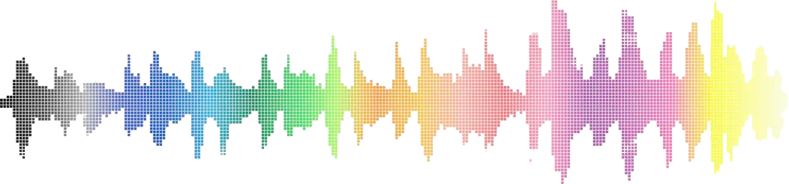
<h1>Spotify Top Hits Outlier Analysis</h1>

[](https://www.python.org/)
[](https://colab.research.google.com/github/Hum4n01d/ecs171-group-project/blob/main/exploration.ipynb)

An analysis of the most popular tracks of the year on Spotify 2010-2019 using song metadata and audio attributes from Spotify's API.

##### Table of Contents

[Introduction](#introduction)<br>
[Methods](#methods)<br>
[Results](#results)<br>
[Discussion](#discussion)<br>
[Conclusion](#conclusion)<br>
[Collaboration](#collaboration)

##### Background

Created for ECS 171 Fall 2022 <br>
University of California, Davis <br>
Dr. Edwin Solares

## Introduction

It can often feel like every popular song sounds the same; the radio hits just reuse the same sonic formula over and over with great success.

However, there are also plenty of songs that totally break the mold and still see chart sucess. We set out to analyze the top hits of the last decade and identify which songs stand out from the rest.

We analyzed a dataset of top hits by year populated with data from Spotify's song database about various audio and song attributes

**Track Metadata**
| column | description |
| --- | --- |
| title | Song title |
| artist | Song artist |
| top genre | Song genre category |
| year | Song Billboard chart entry year |

**Audio Numerical Quantitive Data**
| column | description |
| --- | --- |
| db | Loudness - How loud a song is (db) |
| dur | Duration - How long the song is (seconds) |
| bpm | Tempo - How fast a song is (bpm) |

**Audio Qualitative Data**
| column | description |
| --- | --- |
| nrgy | Energy level - How energetic the song is |
| dnce | Dancability - How easy it is to dance to |
| live | Liveness - How likely a song is to a be a live recording |
| val | Valence - How positive the mood of the song is |
| acous | Acousticness - How accoustic sounding the song is |
| spch | Speechiness - How much of a song is spoken word |
| pop | Popularity - How popular a song is (as of time of data collection) |

Data collected by by Leonardo Henrique on Kaggle: [Top Spotify songs from 2010-2019 - BY YEAR](https://www.kaggle.com/datasets/leonardopena/top-spotify-songs-from-20102019-by-year)

## Methods

### Data Exploration

We first checked for any missing values in data:

```py
df.isnull().sum()
```

Then we plotted a pairplot and correlation heatmap in order to look at the distributions of the features as well as how correlated each feature is to the other features:

```py
sns.pairplot(df)
corr = df.corr(numeric_only=True)
fig, ax = plt.subplots(figsize=(10,8))
sns.heatmap(corr, vmin=-1, vmax=1, center=0, annot=True, cmap='RdBu', ax=ax)
```

### Data Preprocessing

First, we normalized the data using the MinMaxScaler from sklearn.preproessing:

```py
from sklearn.preprocessing import MinMaxScaler
scaler = MinMaxScaler()
metadata = ['title', 'artist', 'top genre', 'year']
normdf = pd.DataFrame(scaler.fit_transform(df.drop(columns=metadata)), columns=df.drop(columns=metadata).columns)
```

Then, we applied PCA to our numerical data, reducing the amount of numerical features down to 5:
from sklearn import decomposition

```py
pca = decomposition.PCA(n_components=5)
pca.fit(normdf)
normdf = pd.DataFrame(pca.transform(normdf))
```

Finally, we used value replacement on the categorical data:

```py
metadata_dict = {}
for i in metadata:
   dict = {}
   metadata_dict[i] = {}
   for j in range(len(df[i].unique())):
       dict[df[i].unique()[j]] = j
       metadata_dict[i][j] = df[i].unique()[j]
   normdf[i] = df[i].map(dict)
```

### Model

For our model, we used K-Prototypes for our clustering algorithm. We ran K-Prototypes for clusters ranging from 2 to 9 and calculated silhouette values:

<details>
<summary>Model Code</summary>

```py
from kmodes.kprototypes import KPrototypes
from matplotlib import pyplot as plt
import matplotlib.cm as cm

# Functions for calculating distance
def matching_dissim(a, b):
    return np.sum(a != b)

def euclidean_dissim(a, b):
    return np.sum((a - b) ** 2)

# Split data into numerical and categorical
num = normdf.to_numpy()[:,0:5]
cat = normdf.to_numpy()[:,5:9]

# Set weight to half of the mean standard deviation of the numerical data
gamma = 0.5 * np.mean(num.std(axis=0))

# Track cost values for each iteration of K-Prototypes
# Also plot silhouette values

costs = []

def calc_silhouette(i, labels, centroids):
    # Find closest cluster
    closest_cluster = -1
    min_dist = -1
    for j in range(len(centroids)):
        if j != labels[i]:
            num_cost = euclidean_dissim(centroids[j][0:5], centroids[labels[i]][0:5])
            cat_cost = matching_dissim(centroids[j][5:9], centroids[labels[i]][5:9])
            dist = num_cost + gamma * cat_cost
            if min_dist == -1 or min_dist > dist:
                min_dist = dist
                closest_cluster = j

    # Calculate average distance in same cluster
    cnt = 0
    a = 0
    for j in range(len(labels)):
        if i != j and labels[i] == labels[j]:
            cnt += 1
            num_cost = euclidean_dissim(num[j], num[i])
            cat_cost = matching_dissim(cat[j], cat[i])
            a += num_cost + gamma * cat_cost
    a = a / cnt

    # Calculate average distance in closest cluster
    cnt = 0
    b = 0
    for j in range(len(labels)):
        if i != j and labels[j] == closest_cluster:
            cnt += 1
            num_cost = euclidean_dissim(num[j], num[i])
            cat_cost = matching_dissim(cat[j], cat[i])
            b += num_cost + gamma * cat_cost
    b = b / cnt

    return (b - a)/max(b, a)

for cluster in range(2, 10):
    # Run K-Prototypes
    kprototype = KPrototypes(n_jobs = -1, n_clusters = cluster, init = 'Huang')
    kprototype.fit(normdf.to_numpy(), categorical = [5,6,7,8])
    labels = kprototype.labels_
    centroids = kprototype.cluster_centroids_
    costs.append(kprototype.cost_)
    print(f'{cluster} clusters cost: {kprototype.cost_}')

    # Plot silhouette
    silhouette_vals = []
    for i in range(len(normdf)):
        silhouette_vals.append(calc_silhouette(i, labels, centroids))
    avg = sum(silhouette_vals)/len(silhouette_vals)

    fig, ax = plt.subplots(1, 1)
    fig.set_size_inches(7, 5)
    ax.set_xlim([-1, 1])
    ax.set_ylim([0, len(normdf) + (cluster + 1) * 10])
    y_lower = 10
    for i in range(cluster):
        # Get silhouette values for cluster i
        silhouette_vals_i = []
        for j in range(len(normdf)):
            if labels[j] == i:
                silhouette_vals_i.append(silhouette_vals[j])

        silhouette_vals_i.sort()

        cluster_size = len(silhouette_vals_i)
        y_upper = y_lower + cluster_size

        color = cm.nipy_spectral(float(i) / cluster)
        ax.fill_betweenx(np.arange(y_lower, y_upper),
                          0, silhouette_vals_i,
                          facecolor=color, edgecolor=color, alpha=0.7)

        ax.text(-0.1, y_lower + 0.5 * cluster_size, str(i))

        y_lower = y_upper + 10

    ax.set_title(f'Silhouette plot for {cluster} clusters')
    ax.set_xlabel('Silhouette Values')
    ax.set_yticks([])
    ax.axvline(x=avg, color="red", linestyle="--")
    plt.show()
```

</details>

Using 7 clusters, we calculated the costs for each data point which is its distance from the centroid of the cluster it belongs to:

```py
costs = []
for i in range(len(normdf)):
   num_cost = euclidean_dissim(num[i], centroids[labels[i]][0:5])
   cat_cost = matching_dissim(cat[i], centroids[labels[i]][5:9])
   costs.append(num_cost + gamma * cat_cost)
```

## Results

### Data Exploration

Through the data exploration, we were able to identify that there were no missing data points in our data and that our feature distributions were not normally distributed. Histograms shown in the pairplot and the descriptions of our data points show our features were skewed. As an interesting factor, heatmap explained which features were positively or negatively correlated with other features. For example, it showed how acoustic feature is negatively correlated with energy, which is understandable.

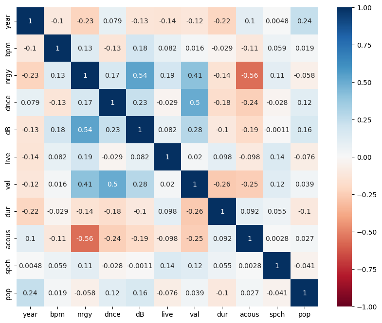
<td>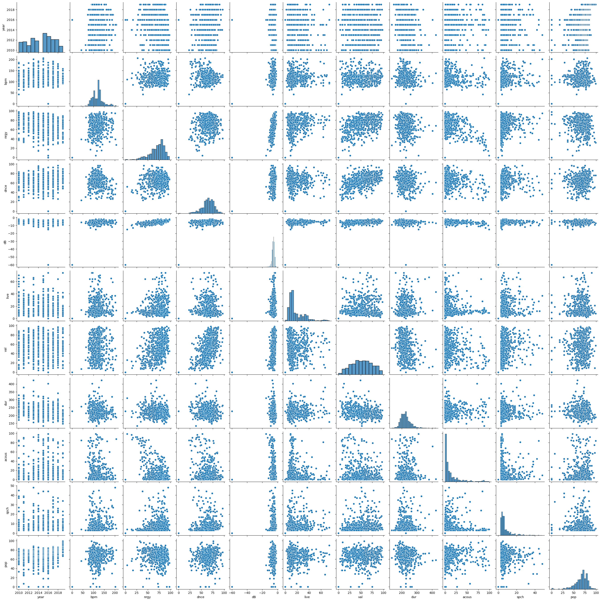

### Preprocessing

After preprocessing our data, 10 numerical features and 4 categorical features went down to 5 numerical and 4 categorical features. Additionally, we encoded categorical features as numbers to prevent them from causing errors as having them as strings.
Model
From running K-Prototypes and calculating the silhouette values, we got the costs below:

(1) 2 clusters:


2 clusters cost: 277.1148952170844

(2) 3 clusters:

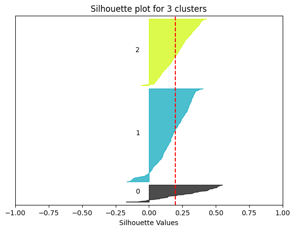

3 clusters cost: 257.03316429766187

(3) 4 clusters:

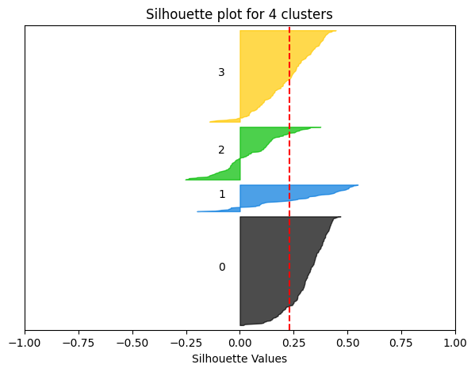

4 clusters cost: 245.25165685232488

(4) 5 clusters:

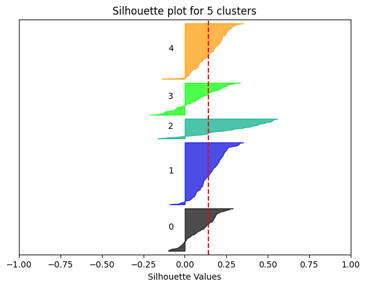

5 clusters cost: 237.4183921758935

(5) 6 clusters:

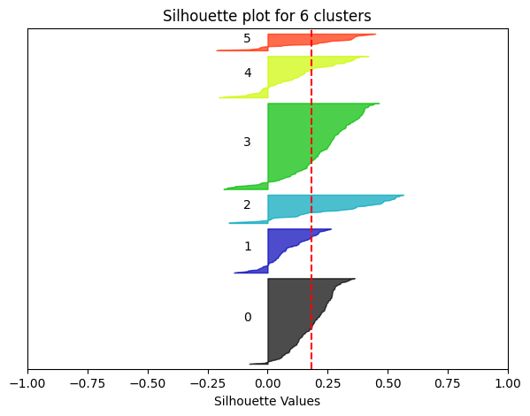

6 clusters cost: 231.13674373180274

(6) 7 clusters:

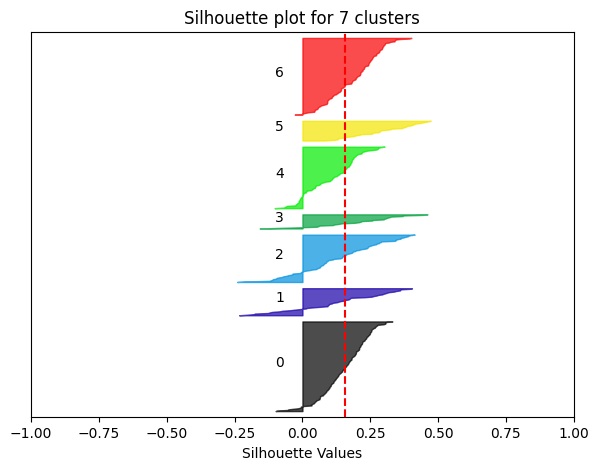

7 clusters cost: 225.65400238275424

(7) 8 clusters:

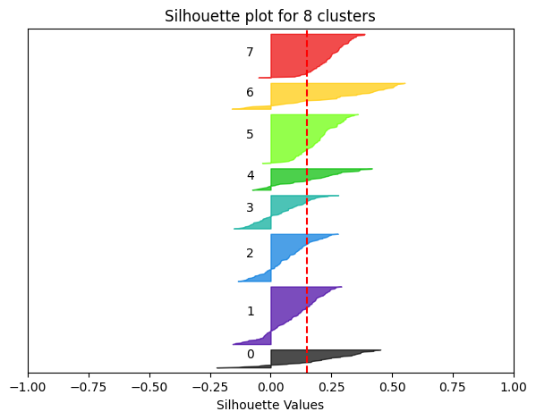

8 clusters cost: 222.9051058403315

(8) 9 clusters:

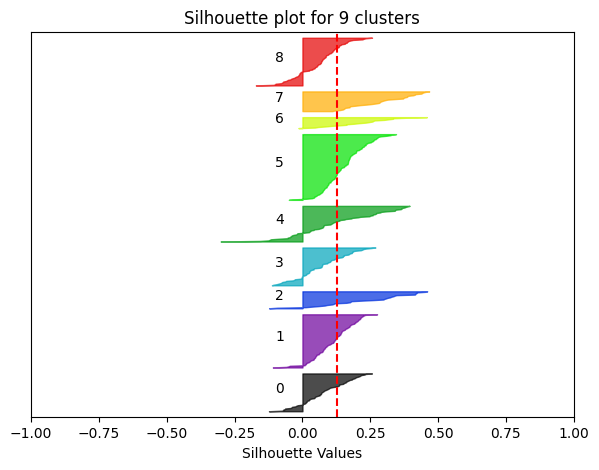

9 clusters cost: 217.96336310134643

Selecting 7 clusters, we got that our top 10 highest cost songs were:

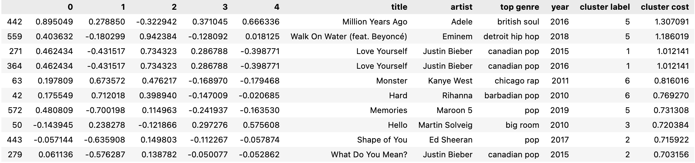

These are the songs that stood out from the other hit songs from 2010-2019.

## Discussion

### Preprocessing

Noting how some of the data distributions for our features are skewed, we decided to normalize our data. Then, we used PCA in order to train our model more quickly through the reduction in features as well as condense features that may have some correlation. For example, energy and dB seemed correlated, which makes sense, and so PCA would help with compressing their correlation so we don’t have overfitting.
Additionally, while exploring the data, we believed all data points would be valid numbers, so we solely checked whether there were any null values. However, there was a song called “Million Years Ago” by Adele where in the data, it showed that the song has 0 bpm which shouldn’t be possible. Some of the other features of the song appeared valid though, so we kept the song in our data which may have affected the results of our model.

### Model

For the model, we definitely wanted to use some clustering algorithm to group similar songs and identify outliers through those clusters. However, the K-Means clustering algorithm only worked with numerical data. So, after researching other clustering algorithms, we came across the K-Prototypes clustering algorithm which works with both numerical and categorical data, using two types of distance: one to calculate the distance between numerical data and one to calculate the distance between categorical data. We ended up going with this algorithm for our clustering.

We picked 7 centroids for our K-Prototypes clustering algorithm using the elbow method and looked at the silhouette plot for 7 centroids. We can see that k=7 is at the “elbow” of our cost plot. Additionally, the silhouette plot for 7 centroids is relatively uniform with respect to the average silhouette value. Then, we selected the top 10 hit songs that stood out the most by selecting the songs with the largest cost since the higher the cost, the further these songs were from their respective clusters, implying that they were kind of like outliers.

## Conclusion

Though we classified the 10 songs with the largest cost as the ones that stood out the most, it’s hard to tell if they really are outliers. So, maybe coming up with some method to evaluate how much of an outlier some data point is could be a next step. Additionally, it would have been cool if we had more features on the musicality of the songs such as maybe chord progressions since it’s common for popular songs to use very similar chord progressions.

A future direction we could go towards is applying this not only to hit songs but to songs in general. For example, allowing users to identify their “unique” songs in one of their playlists. This is a fun feature that could be added on top of already existing song recommendation algorithms. Additionally, maybe music producers could use this model or something similar in order to produce music that doesn’t fit current trends.

## Collaboration

Kent Williams

- Investigated data source and attribute meanings
- Wrote final introduction
- Organized data preprocessing
- Reformatted submission as markdown

Inseon Kim

- Checked group members’ availability and arranged meetings
- Wrote results
- Helped code snippets while working over discord

Theodore Pan

- Contributed to coming up with the project idea
- Researched models we could use
- Implemented custom cost functions for data points
- Made silhouette plots

## References

- https://towardsdatascience.com/the-k-prototype-as-clustering-algorithm-for-mixed-data-type-categorical-and-numerical-fe7c50538ebb
- https://towardsdatascience.com/silhouette-method-better-than-elbow-method-to-find-optimal-clusters-378d62ff6891
